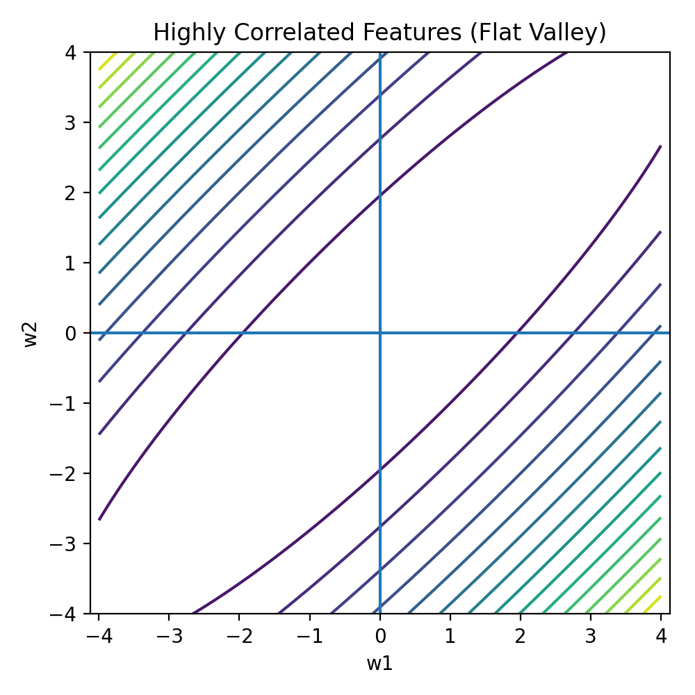
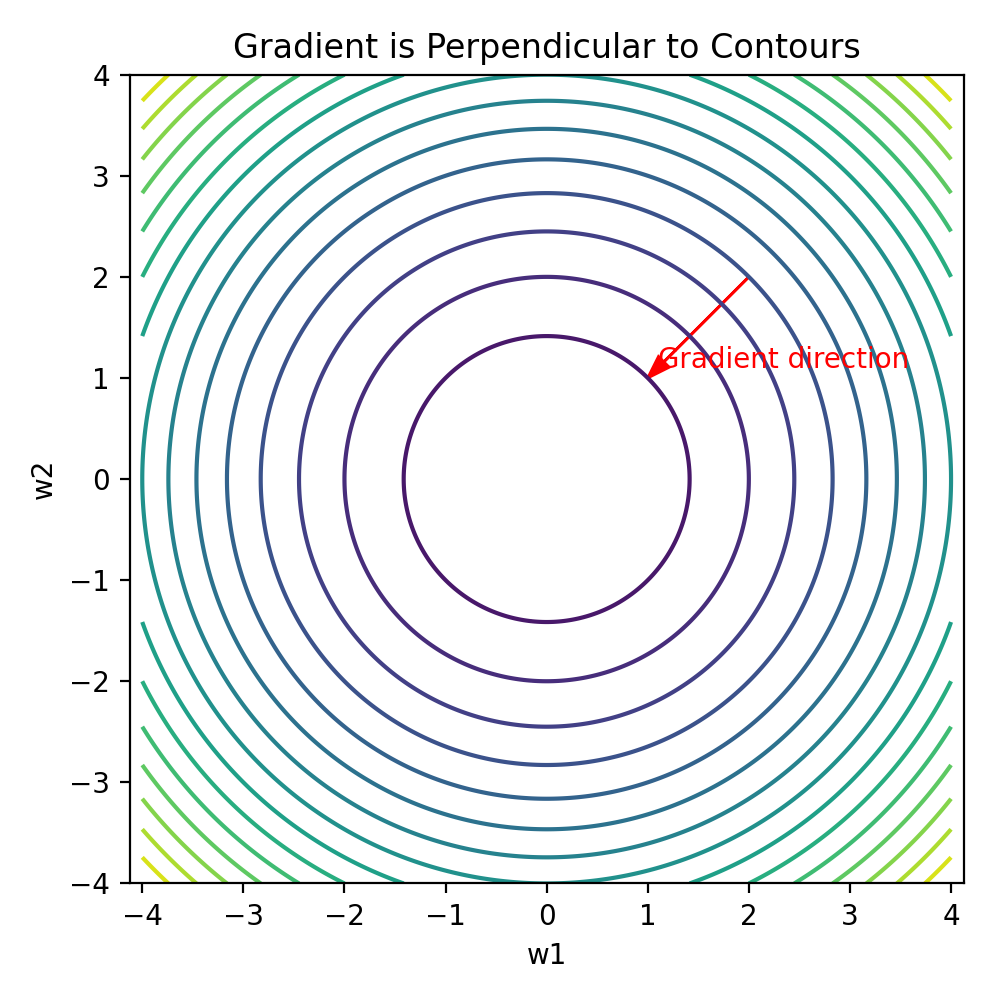
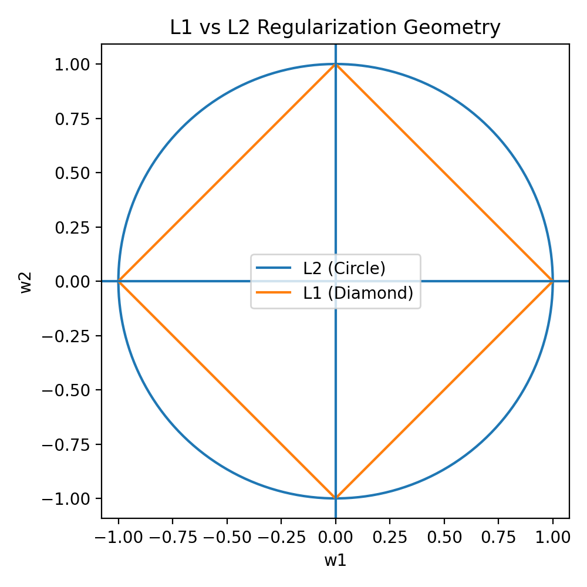

# Regularization Geometry: Loss Contours, Directions, and Sparsity

> **Goal of this note**  
To build an *intuitive + geometric* understanding of:
- what **contours** are
- why squared-error loss creates **ellipses**
- how **training** moves across contours
- how **regularization** introduces a competing force
- why **L1** produces exact zeros and **L2** produces shrinkage

This note is written so that you can read it *without* assuming prior geometry knowledge.

---

## 1. What problem are we solving in regression?

In regression, we want to predict a **continuous target**:

\[
\hat{y} = Xw
\]

During training, we choose the parameters \(w\) such that the **training error** is minimized. With squared error loss:

\[
\text{Loss}(w) = \|y - Xw\|_2^2
\]

This loss is a **function of the parameters**, not of the data points.

So we study the loss in **parameter space**.

---

## 2. Parameter space vs data space (very important)

- **Data space**: inputs \(x\) vs targets \(y\)
- **Parameter space**: model weights \((w_1, w_2, \dots)\)

All the plots here live in **parameter space**.

When we draw axes \(w_1\) and \(w_2\), every point represents **one model**.

---

## 3. Loss surface: why we say “bowl”

For linear regression with squared error:

\[
\text{Loss}(w) = \|y - Xw\|_2^2
\]

This is a **quadratic function** of \(w\).

Quadratic ⇒ convex ⇒ one global minimum.

Geometrically:
- with 1 parameter → a **U-shaped curve**
- with 2 parameters → a **bowl (paraboloid)**
- with many parameters → a **high-dimensional bowl**

The important point:

> “Bowl” does **not** mean round — it means *convex with a single minimum*.

---

## 4. What is a contour? (simple explanation)

A **contour** is:

> a curve connecting all parameter values that give the **same loss**.

Think of a hill:
- height = loss
- walking along a contour = staying at the same height

Contours are obtained by slicing the loss surface horizontally.

---

## 5. Why contours look like ellipses (no equations, pure intuition)

This section explains **why contours look like ellipses** without assuming any math background.

### 5.1 First: what a contour is (recap in one line)

A contour is simply:

> **All the weight values \((w_1, w_2)\) that give the same training error.**

So when you draw a contour, you are drawing:
> “If I choose *any* of these weights, my model performs equally well on training data.”

---

### 5.2 Why changing weights changes loss smoothly

In linear regression:
- Predictions change **linearly** with weights
- Errors are **squared**

This means:
- Small change in weights → small change in loss
- Bigger change → bigger increase in loss

There are **no jumps**, **no sharp corners**, **no sudden cliffs**.

So the loss surface is **smooth**.

---

### 5.3 Imagine standing at the best-fit point

Now imagine you are standing at the **best-fit weights** (the lowest point of the bowl).

Ask yourself:
> “If I move a *tiny bit* away from here, how much does the loss increase?”

Important observation:
- Moving away in *any direction* increases loss
- But **some directions increase loss faster than others**

This difference in speed is the key reason for ellipses.

---

### 5.4 Same loss in all directions? Then we get a circle

If:
- Changing \(w_1\) increases loss
- Changing \(w_2\) increases loss
- Both increase it **at the same rate**

Then:
- All points at the same “distance” from the minimum have the same loss

That shape is a **circle**.

> Same penalty in all directions ⇒ circle.

---

### 5.5 Different sensitivity in different directions ⇒ ellipse

In real data:
- Some weight directions matter **a lot**
- Some weight directions matter **very little**

So:
- Moving in one direction increases loss quickly
- Moving in another direction barely changes loss

Now ask:
> “Which points have the same loss?”

Answer:
- You must move **less** in sensitive directions
- You can move **more** in insensitive directions

That produces a **stretched circle**, which is exactly an **ellipse**.

> Ellipse = circle stretched differently along different directions.

---

### 5.6 Why correlated features stretch the ellipse

When features are correlated:
- Increasing one weight
- Decreasing the other

Can keep predictions almost the same.

So the loss:
- Barely changes along that direction
- Changes rapidly in the perpendicular direction

This creates:
- A **long, flat valley**
- Ellipses stretched into long shapes

When extremely stretched, ellipses can look like **parallel lines** locally.

---

### 5.7 Very important clarification

Even if contours look like parallel lines:
- The surface is **still a bowl**
- There is **still one global minimum**
- Curvature exists, but is very small in one direction

You are just seeing a **zoomed-in flat region** of a very large ellipse.

---

### 5.8 Visual intuition: how correlation changes contour shapes

Below are **three visual cases** you should always keep in mind. These are *loss contours in parameter space* (\(w_1, w_2\)).

---

#### Case A: Uncorrelated features (round bowl)

```md

```

**What this shows**:
- Features act independently
- Loss increases equally in all directions
- Contours look almost **circular**

**Mental model**:
> Any direction you move away from the minimum hurts the model equally.

---

#### Case B: Slightly correlated features (mildly stretched bowl)

```md

```

**What this shows**:
- Some directions matter more than others
- Loss grows faster in one direction, slower in another
- Contours become **elliptical**

**Mental model**:
> The bowl is still smooth, but it is no longer symmetric.

---

#### Case C: Highly correlated features (flat valley)

```md

```

**What this shows**:
- Many combinations of weights give similar predictions
- Loss barely changes along one direction
- Contours look like **parallel diagonal lines** locally

**Mental model**:
> The bowl has turned into a long canyon with a flat floor.

---

### 5.9 Critical clarification (why this is still a bowl)

Even in the highly correlated case:
- The surface is **still convex**
- A global minimum **still exists**
- Curvature is just extremely small in one direction

This is why optimization becomes unstable and why **regularization is needed**.

---

### 5.10 One sentence to remember forever

> **Contours look like circles, ellipses, or parallel lines depending on how evenly the loss reacts to changes in different weight directions, which is controlled by feature correlation.**

---

## 6. How training moves: crossing contours

Training wants one thing:

> **reduce loss as fast as possible**

- Moving *along* a contour → loss does not change
- Moving *across* contours → loss changes

The fastest way down a hill is **perpendicular to the contour**.

This direction is the **negative gradient**.

So gradient descent always crosses contours **orthogonally**.

---

## 7. Two centers that must not be confused

There are **two different centers** in this story:

### 1️⃣ Center of loss (data fit)

\[
w_{\text{OLS}} = \arg\min \|y - Xw\|^2
\]

- This is the **best-fit solution**
- Ellipses are centered here
- Usually **not at zero**

### 2️⃣ Center of regularization

\[
w = 0
\]

- Zero coefficients
- Where regularization penalty is smallest

These two centers are **not the same**.

---

## 8. What regularization really says

Regularization does **not** say:
- “make loss zero”

It says:

> “I am willing to accept a *slightly higher training loss* if my coefficients are much smaller.”

Mathematically:

\[
\min_w \; \|y - Xw\|^2 + \lambda \cdot \text{Penalty}(w)
\]

This creates a **trade-off**.

---

## 9. Regularization geometry

### L2 (Ridge)

Penalty:

\[
\lambda (w_1^2 + w_2^2)
\]

Allowed region:

\[
w_1^2 + w_2^2 \le c
\]

Shape:
- **circle**
- smooth boundary

Effect:
- coefficients shrink smoothly
- rarely become exactly zero

---

### L1 (LASSO)

Penalty:

\[
\lambda (|w_1| + |w_2|)
\]

Allowed region:

\[
|w_1| + |w_2| \le c
\]

Shape:
- **diamond**
- sharp corners on axes

Effect:
- solution often hits a corner
- one coefficient becomes **exactly zero**

---

## 10. Competing directions (key intuition)

At any point in parameter space, there are two forces:

- **Loss gradient** → pulls toward best data fit
- **Regularization gradient** → pulls toward zero

The final solution is where these two balance.

> Regularization does **not** move the loss surface.  
> It adds a competing pull toward the origin.

---

## 11. How to use the visual

Insert the following image in this section:

```md

```

That image should show:
- elliptical loss contours
- L2 circle and L1 diamond
- arrow toward OLS (data fit)
- arrow toward origin (regularization)

This single image captures the entire idea.

---

## 12. One-sentence takeaway

> **Regularization trades a small increase in training error for a large decrease in coefficient magnitude by pulling the solution toward the origin, and the geometry of the penalty determines whether coefficients shrink smoothly (L2) or become exactly zero (L1).**

---

## 13. Why this matters

This geometry explains:
- why correlated features cause instability
- why ridge fixes conditioning
- why LASSO performs feature selection
- why regularization improves generalization

Once this picture is clear, the math becomes inevitable.


---

# One-Page Visual Summary: Loss Geometry & Regularization

> **Read this section end-to-end once.**  
> If this page makes sense, you understand the full geometry of linear regression + regularization.

---

## 1. What space are we in?

We are working in **parameter space**, not data space.

- X-axis → weight \(w_1\)
- Y-axis → weight \(w_2\)
- Height (implicit) → training loss

Each point = **one model**.

---

## 2. Loss surface & contours (data fitting only)

```md

```

### What this image means
- Each closed curve is a **contour**
- A contour = all \((w_1, w_2)\) giving the **same loss**
- Inner contours → lower loss
- Outer contours → higher loss

### Key idea
> Squared error creates a **smooth bowl-shaped loss surface**, and contours are horizontal slices of that bowl.

---

## 3. Effect of feature correlation on contours

### (a) Uncorrelated features

```md

```

- Loss increases equally in all directions
- Contours look almost **circular**

Mental model:
> Every direction away from the minimum hurts equally.

---

### (b) Slightly correlated features

```md

```

- Some directions matter more than others
- Contours become **elliptical**

Mental model:
> The bowl is still smooth, but stretched.

---

### (c) Highly correlated features

```md

```

- One direction is almost flat
- Contours look like **parallel diagonal lines** locally

Mental model:
> Many weight combinations give almost the same predictions.

---

## 4. How training moves (gradient direction)

```md

```

### Arrow explanation
- The arrow shows **gradient descent**
- It always crosses contours **perpendicularly**

Why?
- Moving along a contour does not change loss
- Perpendicular direction gives **fastest loss reduction**

---

## 5. Two competing forces (this is the core idea)

```md

```

### Annotations in the image
- **Green arrow** → pull of data fitting (toward best-fit weights)
- **Black arrow** → pull of regularization (toward zero)
- **Ellipses** → loss contours (centered at best fit)
- **Origin** → zero weights (center of regularization)

---

## 6. Regularization shapes

```md

```

### L2 (Ridge)
- Shape: **circle**
- Boundary is smooth
- Solution shrinks weights smoothly

### L1 (LASSO)
- Shape: **diamond**
- Sharp corners on axes
- Solution often lands on a corner → **exact zero coefficient**

---

## 7. What regularization is *actually* doing

> Regularization does **not** try to make loss zero.

Instead, it says:

> “I accept a small increase in training loss if it keeps my coefficients small and stable.”

So the final solution is a **compromise** between:
- best data fit
- smallest weights

---

## 8. One-sentence takeaway (memorize this)

> **Squared error creates a bowl-shaped loss surface; contours show equal loss, gradient descent moves perpendicular to them, and regularization adds a competing pull toward zero whose geometry (circle vs diamond) determines shrinkage or sparsity.**

---

## 9. Image checklist for your repo

Place these files in your repository:

```
images/
 ├─ contours_uncorrelated.png
 ├─ contours_slightly_correlated.png
 ├─ contours_highly_correlated.png
 ├─ gradient_perpendicular.png
 ├─ loss_vs_regularization_directions.png
 └─ l1_l2_geometry.png
```

This single page + these images fully explain the geometry of regression and regularization.

